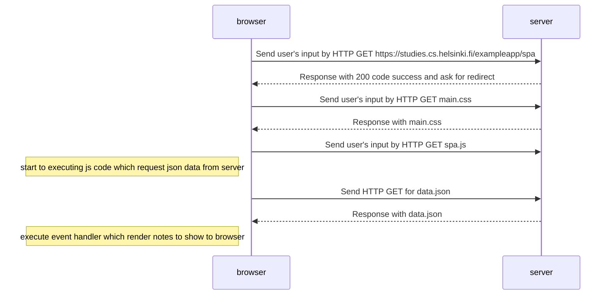

```mermaid
sequenceDiagram
    participant browser
    participant server 
    browser->>server: Send user's input by HTTP GET https://studies.cs.helsinki.fi/exampleapp/spa
    server-->>browser: Response with 200 code success and ask for redirect 
    browser->>server: Send user's input by HTTP GET main.css
    server-->>browser: Response with main.css
    browser->>server: Send user's input by HTTP GET spa.js
    Note left of browser: start to executing js code which request json data from server
    browser->>server: Send HTTP GET for data.json 
    server-->>browser: Response with data.json
    Note left of browser: execute event handler which render notes to show to browser 
```

