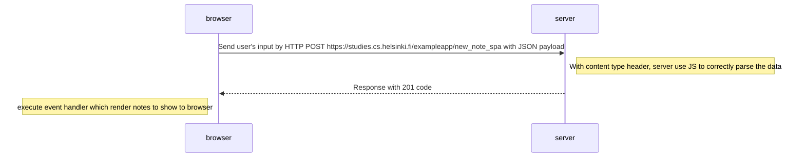

```mermaid
sequenceDiagram
    participant browser
    participant server 
    browser->>server: Send user's input by HTTP POST https://studies.cs.helsinki.fi/exampleapp/new_note_spa with JSON payload
    Note right of server: With content type header, server use JS to correctly parse the data
    server-->>browser: Response with 201 code
    Note left of browser: execute event handler which render notes to show to browser 
```

